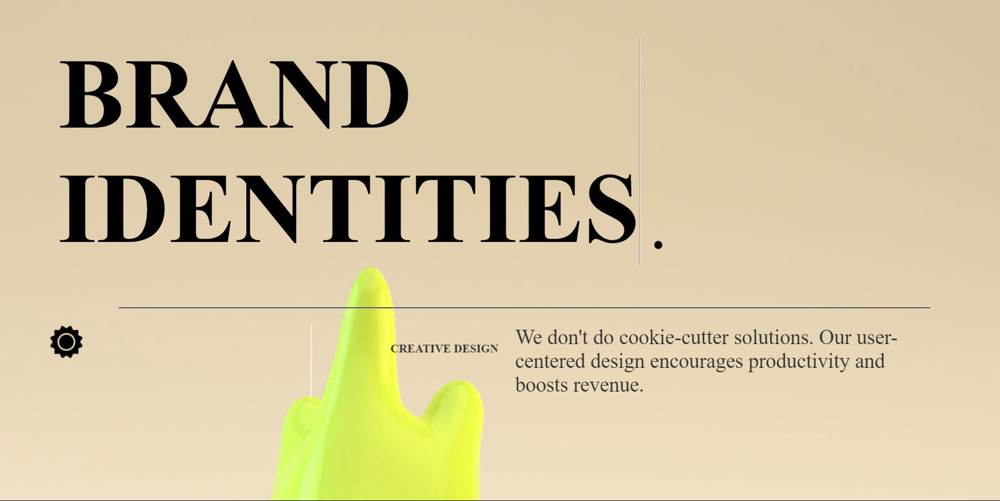

# All Safe Home Page

This documentation provides an overview of the React project, detailing the components and their functionalities.

## Overview

The project is a React application for recreaing the All Safe Home Page.
structured with various components, providing a dynamic and interactive user interface. It includes custom components for videos, SVG manipulation, infinite scrollbars, and more.

## Components

### `App`

- The main component that orchestrates all other components.
- Manages state `currentVideo` for video context of the mouse across the application

### `CursorContext`

- Provides a React context for cursor state management.
- Used to share the current video state across components.

### `VideoSider`

- Displays a video slider with titles.
- Accepts video source and title text as props.

### `LineBreak`

- A simple line break component for visual separation in the UI.

### `SvgContainer`

- Container for SVG elements.
- Can be used to manipulate SVG graphics within the app.

### `DropedShapes`

- Component for displaying draggable shapes.
- Useful for interactive graphic elements on the page.

### `InfiniteScrollbar`

- An infinite scroll component, possibly used for a skills section.
- Implements a scrollbar with endless content loading.

### `AllCards`

- Displays a collection of flip cards.
- Used for showcasing items like projects or skills.

### `SectionAchev`

- A section dedicated to achievements or milestones.
- Displays content related to personal or project achievements.

### `Cursor`

- Custom cursor component.
- Enhances the default cursor experience on the application.

### `Landing`

- The landing page component.
- First visual interaction for the user.

### `ArtDirection`

- A component focused on artistic aspects.
- Can be used for creative direction or showcasing design work.

### `CoolestProjects`

- Showcases the most significant projects.
- A component to highlight key accomplishments or works.

### `Coin`

- A custom component, possibly for a coin or currency display.
- Can be used for gamification or interactive elements.

### Styles

- The application uses SCSS for styling.
- Used Gsap for animations.
- Used Three.js for 3D graphics.

### Responsive Design

- The application is designed to be responsive in all screen sizes.

## Usage

To run the application, ensure you have Node.js and npm installed. Then run:

```bash
npm install
npm run dev
```

### Screenshots





<!-- copy writes -->

## My Portfolio

- [My Portfolio](ahmedzena.com)
